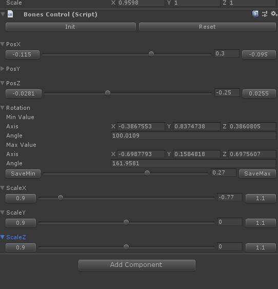
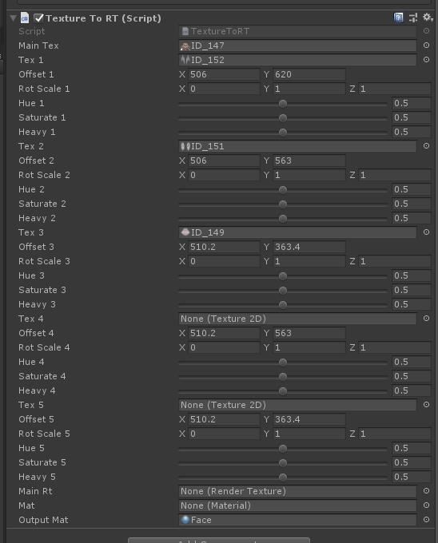
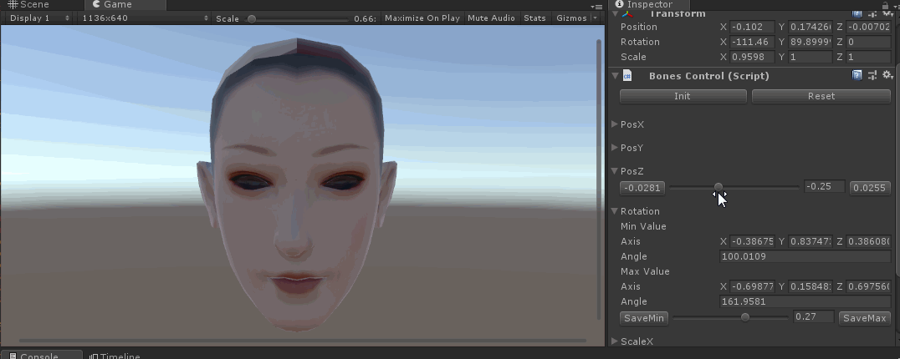
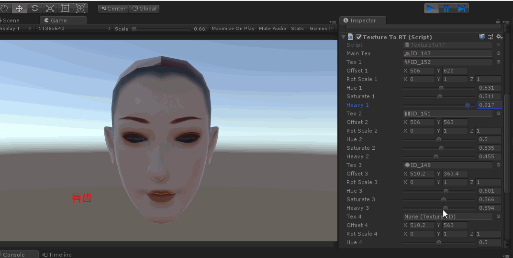

## 游戏中捏脸的实现

本项目关于捏脸的实现主要参考了《楚留香》和《完美世界》手游， 目前主流的游戏关于捏脸的实现主要集中在两个方面：

1. 更改脸部骨骼，捏出不同脸的外形

2. 妆容，在基础的脸型上叠加不同的效果。

## Version

项目使用的unity版本是2018.2.1f， 打开unity工程，运行Example这个scene。

## 编辑器工具

Hierarchy窗口中选中Nose这根骨骼，随便调整Transform一个属性，比如说Position-X 拖拽到骨骼调动的最小值，然后在Inspector的BonesControl对应的面板点击
对应的左边按钮，然后拖拽Position-X到调动的最大值，点击对应属性右边的按钮。点击按钮点击之后，会把记录的值序列化到磁盘当中。
拖拽进度条，就可以预览效果。

Init按钮是保存fbx骨骼参数的初始值，Reset按钮是丢弃捏脸数据，恢复到初始值。

  

Hierarchy窗口中选中Fbx，即脸部的根节点。设置好每个部位对应的贴图和贴图在MainTexture中的偏移。运行Unity,调整Inspector中TextureToRT脚本里的参数（饱和度、
色相、浓淡），即可预览到对应的部位变化。

  

### 骨骼

事先需要做好脸部骨骼的划分，哪些是由蒙皮动画控制的，哪些由程序调整的，然后需要把所有的骨骼都需要绑定到SkinedMeshRender上。

而捏脸控制的就是后者，这些骨骼不能再由Animation来改动。这里我们调整的骨骼参数是位置、旋转、缩放，其中旋转需要指定旋转的轴向。

  

### 妆容

事先把脸划分五个部位，分别是眉妆、眼影、瞳色、唇齿、面纹。 妆容的实现是由一张基础的脸型，然后在之基础上堆叠上部位的贴图。而调整的参数
就是色相、饱和度、浓淡三个参数。 调整好参数之后使用FaceMakeupShader，后处理生成一张RenderTexture, 然后把这张RT（RenderTexture）
再赋给之前的材质。

  

## 说明

本项目旨在展示捏脸的实现原理，在实际的项目开发过程中，其复杂度远远不止于此。 我们需要将预处理好编辑过的骨骼，导出编辑过的数据到二进制文件，
也不会直接在gameobject上挂载脚本。关于如何组织，就看读者的code 能力了。再比如说，你需要写一个工具，能自动裁剪妆容所在的区域，并导出偏移数
据。

## 联系方式

Email: peng_huailiang@qq.com

Blog:  https://huailiang.github.io/